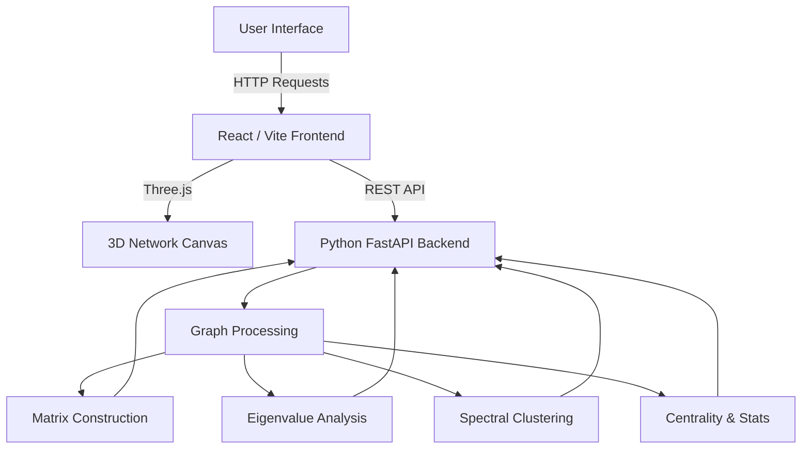

# Social Network Lab
### Discovering Communities Through Linear Algebra


An immersive 3D visualization and analytical engine demonstrating how **Linear Algebra** and **Spectral Graph Theory** can be used to detect hidden communities within social networks.

This project was developed as a university Linear Algebra Mini-Project. It explores the mathematical pipeline of converting a graph into a Laplacian matrix, extracting its eigenvalues and eigenvectors, and clustering the resulting geometric embeddings.

---

## 📖 Table of Contents
- [Project Overview](#-project-overview)
- [Mathematical Foundations](#-mathematical-foundations)
- [Features](#-features)
- [Architecture](#-architecture)
- [Project Structure](#-project-structure)
- [Installation & Usage](#-installation--usage)
- [Dataset](#-dataset)
- [Demonstration Workflow](#-demonstration-workflow)
- [Testing & Troubleshooting](#-testing--troubleshooting)
- [Technology Stack](#-technology-stack)

---

## 🎯 Project Overview

Social networks contain inherent structures—groups of friends, colleagues, or echo chambers. **Community detection** seeks to identify these groups programmatically. 

Instead of relying solely on heuristic graph traversal, this project approaches the problem using **Linear Algebra**. By transforming the topological connections of a graph into a matrix, we can analyze the continuous algebraic properties (eigenvalues) of that matrix to find the optimal mathematical "cut" that separates the graph into distinct communities.

### Objectives
- Compute and analyze graph matrices (Adjacency, Degree, Laplacian).
- Extract eigenvalues and the **Fiedler vector**.
- Perform **Spectral Clustering** via geometric embedding.
- Provide a responsive, immersive 3D visualization of the network topology.

---

## 🧮 Mathematical Foundations

This project strictly adheres to the mathematical principles of Spectral Graph Theory.

### A. Graph Representation
A social network is modeled as an undirected graph $G = (V, E)$, where $V$ represents the set of nodes (people) and $E$ represents the set of edges (friendships/connections).

### B. Adjacency Matrix ($A$)
A symmetric $N \times N$ matrix where $A_{ij} = 1$ if node $i$ and node $j$ are connected, and $0$ otherwise.

### C. Degree Matrix ($D$)
A diagonal $N \times N$ matrix where $D_{ii}$ equals the degree (number of connections) of node $i$.

### D. Graph Laplacian ($L$)
The combinatorial Graph Laplacian acts as a differential operator on the graph:
$$L = D - A$$
Minimizing the quadratic form $x^T L x$ mathematically corresponds to minimizing the number of edges cut when partitioning the graph.

### E. Eigenvalues and Eigenvectors
By solving the eigenvalue equation:
$$L v = \lambda v$$
We extract the eigenvalues ($\lambda$) and eigenvectors ($v$). The multiplicity of the eigenvalue $0$ indicates the number of connected components in the graph.

### F. Fiedler Vector
The eigenvector associated with the **second-smallest eigenvalue** ($\lambda_2$, also known as Algebraic Connectivity) is called the **Fiedler Vector**. The signs of its entries can be used to bi-partition the graph optimally.

### G. Spectral Clustering
For $k > 2$ communities, the project computes the first $k$ eigenvectors of $L$, forms an $N \times k$ matrix, normalizes the rows, and applies the $k$-means algorithm to cluster the nodes in this continuous geometric space.

### H. Evaluation
- **Modularity**: Measures the density of edges inside communities compared to random distribution.
- **Adjusted Rand Index (ARI)**: Measures similarity between the detected clustering and the known ground-truth labels.

---

## ✨ Features

- **Interactive 3D Network Explorer**: A React Three Fiber WebGL scene allowing full rotation, panning, zooming, and node-hover interactivity (highlights neighbors and edges).
- **Community Detection**: Configurable spectral $k$-means clustering, executing in Python and updating the 3D scene in real-time.
- **Matrix Lab**: Inspect dimensions and properties of the Adjacency, Degree, and Laplacian matrices.
- **Eigenvalue Observatory**: Analyzes Algebraic Connectivity and visually maps the Fiedler vector to network nodes.
- **Graph Statistics**: Computes average degree, graph density, average clustering coefficient, and shortest path lengths.
- **Centrality Analysis**: Ranks the top nodes by Degree, Betweenness, and Closeness centrality.
- **Shortest Path Explorer**: Dynamically calculates and renders the shortest traversal path between any two node IDs.
- **Methodology & Viva Mode**: An educational breakdown of the core concepts for academic defense.

---

## 🏗 Architecture

The application separates the heavy linear algebra computations (Python) from the immersive rendering engine (React).



---

## 📂 Project Structure

```text
SocialNetworkClustering/
├── api.py                  # FastAPI Backend entry point
├── app.py                  # Legacy Streamlit fallback UI
├── run_full_stack.bat      # Windows boot script
├── requirements.txt        # Python dependencies
├── src/                    # Python Math Backend
│   ├── data_module.py      # Graph loading & stats
│   ├── laplacian_module.py # L matrix and eigen calculations
│   ├── spectral_module.py  # k-means and bisection
│   ├── matrix_module.py    # A and D matrix logic
│   └── evaluation_module.py# Modularity and ARI
└── frontend/               # React Three Fiber Frontend
    ├── package.json        # NPM dependencies
    ├── vite.config.js      # Vite configuration
    ├── index.html          # Web entry
    └── src/
        ├── App.jsx         # Sidebar, UI overlays, API hooks
        ├── index.css       # Oceanic theme styles
        ├── main.jsx        # React root
        └── components/
            └── NetworkScene.jsx # 3D WebGL Graph implementation
```

---

## 🚀 Installation & Usage

### Prerequisites
- Python 3.11+
- Node.js 18+ (with `npm`)
- Windows OS (for the `.bat` launcher)

### Quick Start (Windows)
1. Clone or download the repository.
2. Open a terminal or command prompt in the project root directory.
3. Run the automated boot script:
   ```cmd
   run_full_stack.bat
   ```
   *This script will automatically install Python `pip` dependencies, install Node `npm` modules, start the FastAPI backend on port 8000, and launch the Vite frontend on port 3000.*

4. Open your browser to `http://localhost:3000`.

### Manual Start (Cross-Platform)

**1. Start the Backend:**
```bash
pip install -r requirements.txt
python -m uvicorn api:app --reload --port 8000
```

**2. Start the Frontend:**
```bash
cd frontend
npm install
npm run dev
```

---

## 📊 Dataset

By default, the application loads **Zachary's Karate Club** (1977).
- **Nodes (34)**: Members of a university karate club.
- **Edges (78)**: Friendships observed outside the club.
- **Context**: A dispute caused the club to split into two factions. This graph is the gold standard for testing community detection algorithms.

---

## 🧭 Demonstration Workflow

1. **Launch the App**: Open `http://localhost:3000`.
2. **Network Explorer**: Use your mouse to rotate the 3D graph. Hover over nodes to see their relationships illuminate.
3. **Graph Statistics**: Check the density and clustering coefficients to understand the graph's overall cohesiveness.
4. **Community Detection**: Navigate to Tab 4, select $k=2$ or $k=3$, and click "Run Clustering". Watch the 3D node colors dynamically update.
5. **Eigenvalues**: Navigate to Tab 6 to inspect the Algebraic Connectivity ($\lambda_2$) that mathematically permitted the split.
6. **Shortest Path**: Navigate to Tab 9 and find the degree of separation between Node 0 and Node 33.

---

## 🛠 Testing & Troubleshooting

### Backend Tests
If you wish to run the internal integrity tests for the math modules:
```bash
python -m pytest tests/
```

### Common Issues
- **Port Conflicts**: Ensure ports `8000` (FastAPI) and `3000` (Vite) are not currently in use by other software.
- **WebGL Crash / Invisible Graph**: Ensure hardware acceleration is enabled in your browser settings. The 3D connections rely on `drei`'s `Line2` which requires WebGL2 support.

---

## 💻 Technology Stack

| Category | Technology | Purpose |
|----------|------------|---------|
| **Languages** | Python 3, JavaScript | Backend math, Frontend interaction |
| **Backend API** | FastAPI, Uvicorn | RESTful API endpoints bridging UI and Math |
| **Frontend** | React 18, Vite | UI Component management and state |
| **3D Rendering** | Three.js, React Three Fiber, Drei | WebGL graph spatial visualization |
| **Graph Processing**| NetworkX | Topology traversal, centrality, shortest path |
| **Linear Algebra** | NumPy, SciPy | Fast matrix decomposition & eigenvectors |
| **Clustering** | Scikit-Learn | $k$-means geometric clustering |
| **Legacy UI** | Streamlit | Original fallback dashboard |

---
*Developed for the PES University Linear Algebra Mini-Project requirement.*
